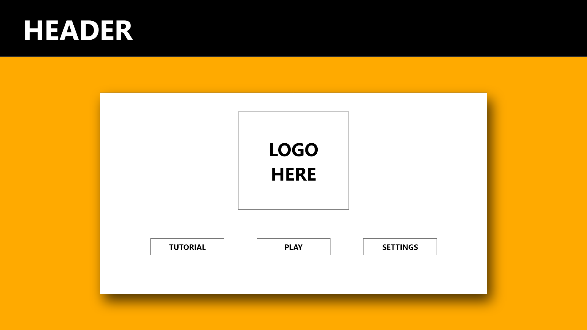
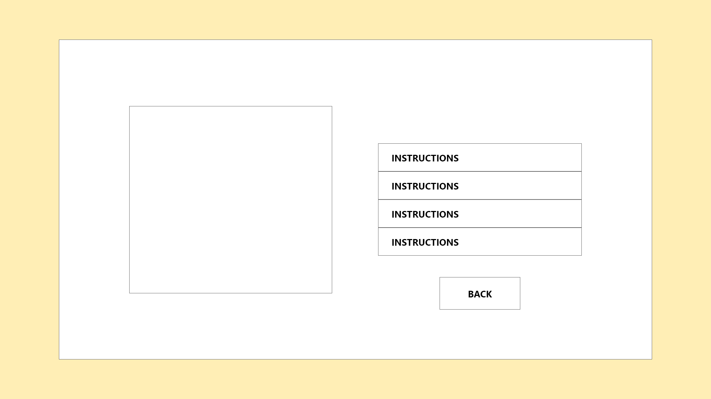
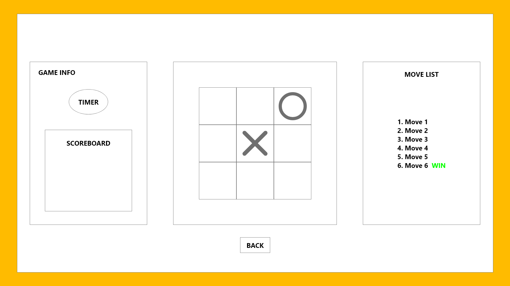
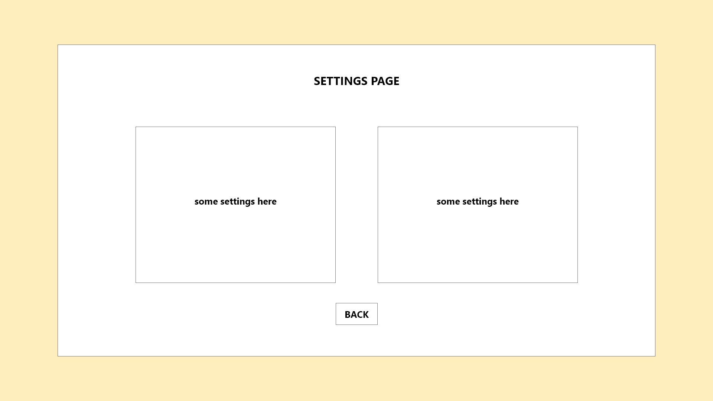

# ACCENNO Documentation

## [ACCENNO](https://pages.git.generalassemb.ly/muhammadarifftaha/accenno/) Web Page

## Introduction

Accenno is a game of noughts and crosses, or tic-tac-toe as some regoins would call it. Accenno is designed to be intuitive and user friendly with a great UI and UX. The rules of the game are as the usual noughts and crosses.

## Installation

No installation is required. Click [here](https://pages.git.generalassemb.ly/muhammadarifftaha/accenno/) to play the game.

### OR

Visit [https://pages.git.generalassemb.ly/muhammadarifftaha/accenno/](https://pages.git.generalassemb.ly/muhammadarifftaha/accenno/)

### OR

Copy this link and paste in in your browser

     https://pages.git.generalassemb.ly/muhammadarifftaha/accenno/

## Pre-Development

### Algorithm Flowchart

[Full Image](/docs/accenno_flowchart_in-depth.png)

### Prototype Screen Capture

## Development, APIs, etc.

A majority of the development was done with basic HTML and JavaScript.

The APIs used in this project:

- Sass
  - All styling was done using sass or scss and was later converted to css for implementation using [Scout-App](https://scout-app.io/)
- jQuery
  - All the DOM manipulation, event handling and animations involved was written with jQuery
- jQuery UI
  - jQuery UI was added to help make better animations and button controls. It was also used to animate certain effects/attributes that would be able to be animated through basic JavaScript andd jQuery methods.
- jQuery plugin : [jquery-circle-progress](https://github.com/kottenator/jquery-circle-progress)
  - jquery-circle-progress was used to animate and provide a visual interface/feedback for the timer

## Approach

[ACCENNO](https://pages.git.generalassemb.ly/muhammadarifftaha/accenno/) was decidely made to reduce the time users may take to figure out what to do. Hopefully, the design choices works well to direct users to where they want to be. (i.e. Playing the Game)

The "How To Play" was by far the most difficult part. The animations were made to help users visualise what they needed to do and it involves mutiple nested `setTimeout`.

The game board is fairly simple using a `<table>` with borders. Each cell is equipped to listen for clicks and aplly the player's marker. There are aslo some board covers to ensure that no unauthorised clicks happen in bewteen turns or during AI's turn. It also serves as a start page for each round of the game.

### Link to Resources

- jQuery - https://api.jquery.com/

- jQuery UI -https://api.jqueryui.com/

- Sass - https://sass-lang.com/

- [kottenator](https://github.com/kottenator "kottenator's GitHub Page")'s Radial Progress Bars - https://github.com/kottenator/jquery-circle-progress

- Flaticon - [https://www.flaticon.com/](https://www.flaticon.com)

  - Quit icons created by alkhalifi design - [Link](https://www.flaticon.com/free-icons/quit)

  - Left click icons created by Ilham Fitrotul Hayat - [Link](https://www.flaticon.com/free-icons/left-click)

  - Play button icons created by Pixel perfect - [Link](https://www.flaticon.com/free-icons/play-button)

  - Line icons created by Roundicons Premium - [Link](https://www.flaticon.com/free-icons/line)

  - O icons created by Freepik - [Link](https://www.flaticon.com/free-icons/o)

  - Close icons created by ariefstudio - [Link](https://www.flaticon.com/free-icons/close)

  - Sun icons created by Freepik - [Link](https://www.flaticon.com/free-icons/sun)

  - Moon icons created by Freepik - [Link](https://www.flaticon.com/free-icons/moon)

  - Sword icons created by Freepik - [Link](https://www.flaticon.com/free-icons/sword)

  - Shield icons created by Freepik - [Link](https://www.flaticon.com/free-icons/shield)

  - Angry icons created by Freepik - [Link](https://www.flaticon.com/free-icons/angry)

  - Cat icons created by Freepik - [Link](https://www.flaticon.com/free-icons/cat)

  - Dog icons created by AomAm - [Link](https://www.flaticon.com/free-icons/dog)

<!-- the approach taken, installation instructions, unsolved problems, etc. -->
